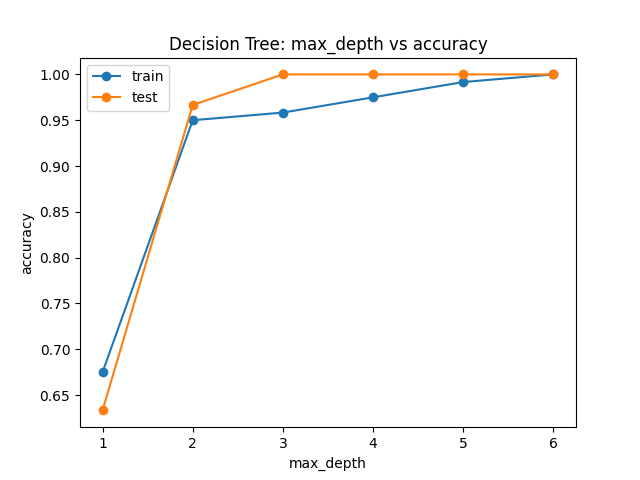
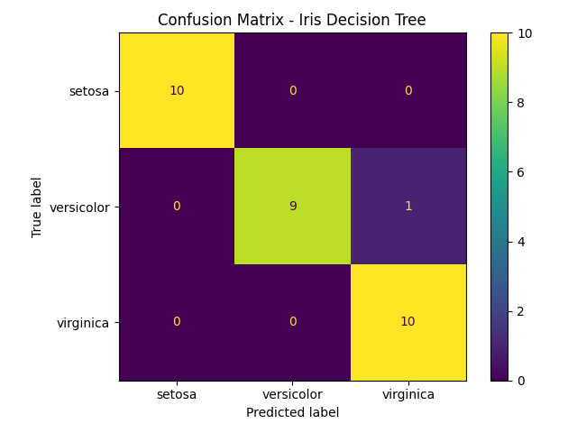

# Iris Classifier — Decision Tree Experiments

## Goal

Understand how a Decision Tree works in practice:

* how it splits data
* how `max_depth` affects performance
* how overfitting appears
* why accuracy alone is not enough

This project focuses on **learning through experiments**, not just theory.

---

## Dataset

* Iris dataset (built into scikit-learn)
* 150 samples
* 3 classes:

  * setosa
  * versicolor
  * virginica

Features:

* sepal length
* sepal width
* petal length
* petal width

---

## Tech Stack

* Python
* scikit-learn
* matplotlib

---

## Project Structure

```bash
src/
  cli.py
  trainer.py
  predictor.py
  model_factory.py
  data_loader.py

  experiments/
    max_depth.py
    confusion_matrix.py

  formatters/
    confusion_matrix_formatter.py

artifacts/
```

---

## How to run

```bash
git clone https://github.com/szymoniwacz/ai-iris-classifier.git
cd ai-iris-classifier

python3 -m venv venv
source venv/bin/activate

pip install -r requirements.txt
```

---

## Available commands

```bash
python -m src.cli train
python -m src.cli predict 5.1 3.5 1.4 0.2
python -m src.cli experiment-max-depth
python -m src.cli experiment-confusion-matrix
```

---

## Basic Model

* DecisionTreeClassifier
* Default experiment with `max_depth=3`

Result:

* high accuracy on test data
* simple and interpretable model

---

## Max Depth Experiment

Tested how tree depth affects performance.

Example output:

```text
depth=1 | train=0.667 | test=0.667
depth=2 | train=0.967 | test=0.933
depth=3 | train=0.983 | test=0.967
depth=4 | train=0.992 | test=0.933
depth=5 | train=1.000 | test=0.933
depth=None | train=1.000 | test=0.933
```

Interpretation:

* Best generalization at depth=3
* Increasing depth improves training accuracy
* Too large depth leads to overfitting (train=1.0, test drops)

Run:

```bash
python -m src.cli experiment-max-depth
```

Output:

* accuracy for different depths
* plot saved to `artifacts/max_depth_plot.png`

Example plot:



---

## Confusion Matrix

Added confusion matrix to better understand model behavior.

Accuracy shows overall performance, but confusion matrix shows **where the model makes mistakes**.

The experiment also prints a classification report. It gives a per-class breakdown of:
* `precision` — of all samples predicted as class X, how many were correct
* `recall` — of all true samples of class X, how many were found
* `F1` — the harmonic average of precision and recall, useful when classes are imbalanced

Example classification report:

```text
              precision    recall  f1-score   support

      setosa       1.00      1.00      1.00        10
  versicolor       0.90      0.90      0.90        10
   virginica       1.00      1.00      1.00        10

    accuracy                           0.97        30
   macro avg       0.97      0.97      0.97        30
weighted avg       0.97      0.97      0.97        30
```

Example output:

```text
=== Confusion Matrix Experiment ===

actual \ predicted         setosa   versicolor    virginica
------------------------------------------------------------
setosa                         10            0            0
versicolor                      0            9            1
virginica                       0            0           10

Summary:
- Correct predictions: 29/30
- Mistakes: 1
- 1 sample(s) of 'versicolor' were predicted as 'virginica'
```

Interpretation:

* setosa: classified perfectly
* versicolor: occasionally confused with virginica
* virginica: classified perfectly

Run:

```bash
python -m src.cli experiment-confusion-matrix
```

Output:

* formatted confusion matrix in terminal
* classification report in terminal
* plot saved to `artifacts/confusion_matrix_plot.png`

Example plot:



---

## What I learned

* Accuracy alone is not enough to evaluate a model
* Confusion matrix helps identify specific classification errors
* Some classes (versicolor vs virginica) are harder to separate
* Controlling model complexity (`max_depth`) helps prevent overfitting
* Clean CLI + experiments structure makes ML code more maintainable

---

## Planned improvements

* Polish current experiments and document results
* Review and improve documentation/examples for the classification report output
* Make sure saved artifacts are generated consistently
* Keep the repo structure clean and CLI-first
